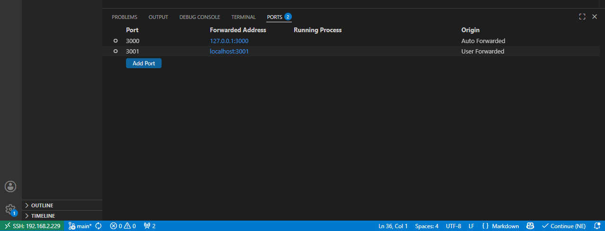

# Запуск ИИ модели
```bash
ollama list
ollama run deepseek-coder-v2
```

# Отладка
Чтобы Trunk не конфликтовал с продакшеном на порту 3000, запускайте его на порту 3001 и явно привязывайте к локальному адресу (чтобы он не торчал наружу в сеть):
```bash
cd aism
nix-shell
trunk serve --port 3001 --address 127.0.0.1
```
Если порт занят кем то другим открываем прописываем другой, но не забываем его пробросить:


# Продуктив
http://192.168.2.229:3000/

```bash
trunk build --release
```

После этого в папке проекта появится директория dist/ со всеми готовыми файлами (HTML, JS, WASM). Перенесите или скопируйте эту папку в постоянное место, например, в 
```bash
sudo mkdir -p /var/www/aism
sudo cp -r dist/* /var/www/aism/
```

Настройка прав доступа для Nginx
```bash
# Делаем пользователя nginx владельцем файлов
sudo chown -R nginx:nginx /var/www/aism

# Разрешаем чтение файлов и вход в папки
sudo chmod -R 755 /var/www/aism
```

# Проброс портов
Поскольку порты закрыты, тестируем и прод и дев через VS Code:

Чтобы порт 3001 открывался на вашем ПК через браузер, пробросьте его вручную в VS Code:
- В нижней панели VS Code найдите вкладку «Порты» (Ports) (обычно она находится рядом с вкладкой Terminal и Output).
- Нажмите кнопку «Добавить порт» (Add Port).
- Введите номер порта: 3001.
- В колонке «Локальный адрес» появится ссылка http://localhost:3001